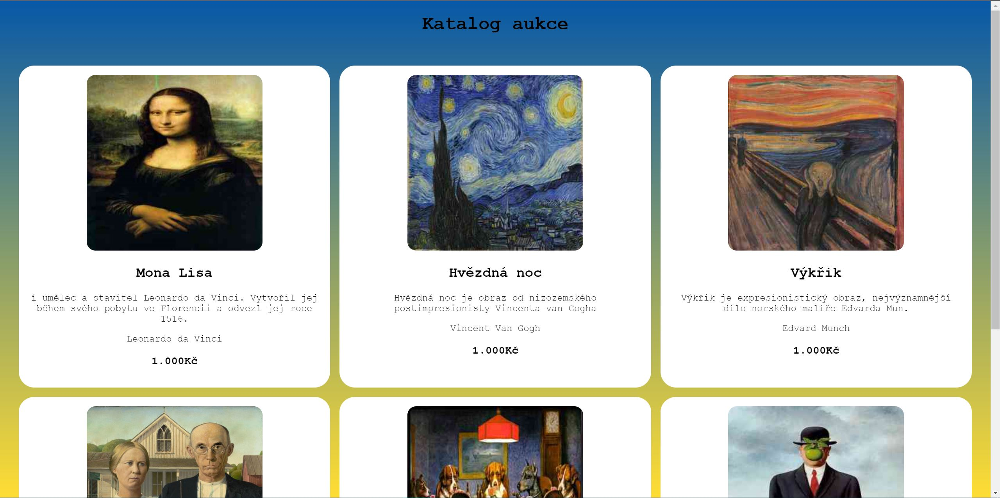
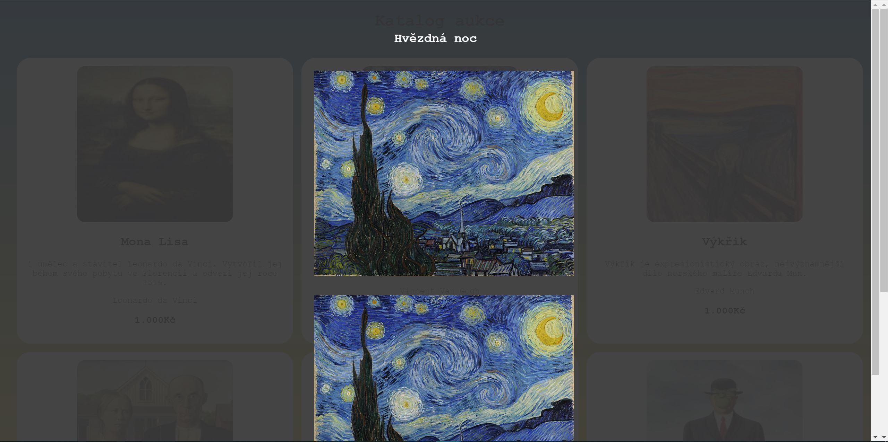

# Auction

## Využití:

Stránka slouží k před aukčnímu náhledu na díla, která půjdou do prodeje + podpora Ukrajiny.

## Funkce:

Stránka je responsivní, moderní, a pravděpodobně funkční. Stránka vám dá potřebné info k produktům, jež nabízí. Např.: název díla, popis, autor, cenu a několik náhledů na dílo.

## Technologie:

Stránka byla uvedena do současného stavu pomocí technologií HTML, JavaScript a SCSS.

## Autoři:

Na stránce se podíleli Martin Job a Imrich Zeleňák. Všechna práce byla spolenčně prokonzultována a společně vytvořena. Oba autoři se podíleli na každé části stránky.

## Pořadí obrázků v data.json:

1.Miniatura
2. a 3. detailní fotky

## Screenshoty:

